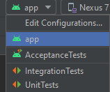
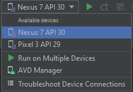

# Purpose

Swapper is a bartering application that allows anyone to exchange items with others instead of using cash. Unlike Kjiji or Craigslist, Swapper makes it fun and easy to trade your used items with others. Our target audience is someone who desires a new way to buy and sell used items.

# Running the Project

1. If you don't have it, install [Java version 8 (1.8) ](https://www.oracle.com/ca-en/java/technologies/javase/javase-jdk8-downloads.html) on your computer

2. We use Android Studio and recommend you do the same for any potential compatibility issues. You can find and download it [here](https://developer.android.com/studio/)

3. Navigate to where you want to store the project and run `git clone https://code.cs.umanitoba.ca/3350-winter-2021-a03/3350-winter-2021-A03_Group2.git`

4. [Create an AVD](https://developer.android.com/studio/run/managing-avds) or [setup your own device](https://developer.android.com/studio/run/device) to run the android application ensuring you have at minimum android 4.1 (API level 16) installed on the device. Optimally you have API level 30

5. Select `app` in the top bar for running the application

   

6. Select the AVD device or ensure your hardware device is properly connected, and hit `Run 'app'` or `shift-f10` to build and run the application on your virtual or hardware device

   

# Documentation

## Product vision

You can read [our product vision](doc/VISION.md) to get a better idea of the application we're trying to develop.

## Architecture

[Our architecture](doc/ARCHITECTURE.md) is based on the layered architecture pattern. We used three layers including Presentation, Logic/Business, and Persistence, and Domain Specific Objects for moving data between the layers.

## Git branching strategy

We use [GitHub flow](https://guides.github.com/introduction/flow/) as [our git branching strategy](doc/BranchingStrategy.md)

## Worksheets

View our in-class worksheets [here](worksheets/)

## Helpful Links & one-liners we try to follow

[Common Git Problems & Fixes](https://ohshitgit.com/)

[Testing with Junit](https://www.vogella.com/tutorials/JUnit4/article.html)

Writing a git commit subject line: **If applied, this commit will...**

